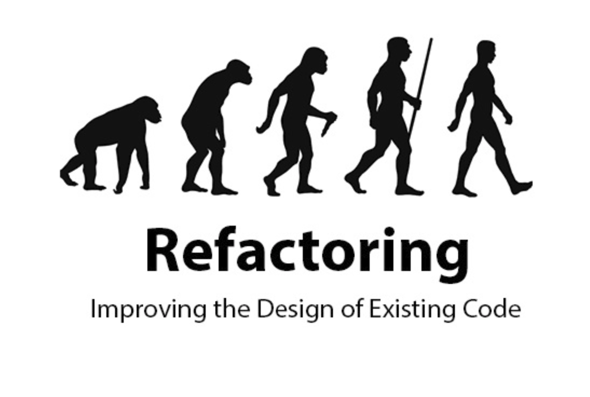

---

## ⚠️Repository Fork [delphi-exemplo-sistema](https://github.com/eversonturossi/delphi-exemplo-sistema)⚠️
>
### Legacy Code
>
* Is your code easy to change?
* Do you get near-instant feedback when you change it? 
* Do you understand?

If your answer to these questions is "no", you have legacy code and it is consuming time and money from your development.

> There are several patterns that can be applied in the refactoring of your code, and these patterns we will be applying in this project, and I believe it will help many to give more useful life to their legacy projects, more performance, more functionality, more reliability and more ability to management.

> The main reason for code refactoring is to improve the maintainability of the software, as well as to make existing code easier to understand.
> * Understand the process and principles of refactoring.
> * Quickly apply convenient refactorings to make a program easier to understand and easier to change.
> * Recognize "bad smells" in code that signal opportunities
 to refactor.
> * Explore the refactorings, each with its own explanation, mechanism.
> * Write robust tests or your refactorings.

1. [Refactoring Principles.](./requirements/refactoring-principles.md)
2. [Bad smell in the code](./requirements/bad-small-code.md)
3. [Refactoring set.](./requirements/refactoring-set.md)
4. [Encapsulation.](./requirements/encapsulation.md)
5. [Moving resources](./requirements/moving-resources.md)
6. [Organizing data](./requirements/organizing-data.md)
7. [Simplifying conditional logics](./requirements/simplifying-conditional-logics.md)
8. [Dealing with inheritance](./requirements/dealing-with-inheritance.md)

> ## Some principles and standards used in this project

> ### Principles

* [Single Responsibility Principle (SRP)](https://en.wikipedia.org/wiki/Single-responsibility_principle)
* [Open Closed Principle (OCP)](https://en.wikipedia.org/wiki/Open%E2%80%93closed_principle)
* [Liskov Substitution Principle (LSP)](https://en.wikipedia.org/wiki/Liskov_substitution_principle)
* [Interface Segregation Principle (ISP)](https://en.wikipedia.org/wiki/Interface_segregation_principle)
* [Dependency Inversion Principle (DIP)](https://en.wikipedia.org/wiki/Dependency_inversion_principle)
* [Separation of Concerns (SOC)](https://en.wikipedia.org/wiki/Separation_of_concerns)
* [Don't Repeat Yourself (DRY)](https://en.wikipedia.org/wiki/Don%27t_repeat_yourself)
* [You Aren't Gonna Need It (YAGNI)](https://en.wikipedia.org/wiki/You_aren%27t_gonna_need_it)
* [Keep It Simple, Silly (KISS)](https://en.wikipedia.org/wiki/KISS_principle)
* [Composition Over Inheritance](https://en.wikipedia.org/wiki/Composition_over_inheritance)
* [Small Commits](https://betterprogramming.pub/why-you-should-write-small-git-commits-c9a042737aa6)

> ### Design Patterns

* [Factory Method](https://en.wikipedia.org/wiki/Factory_method_pattern)
* [Adapter](https://en.wikipedia.org/wiki/Adapter_pattern)
* [Composite](https://en.wikipedia.org/wiki/Composite_pattern)
* [Decorator](https://en.wikipedia.org/wiki/Decorator_pattern)
* [Proxy](https://en.wikipedia.org/wiki/Proxy_pattern)
* [Dependency Injection](https://en.wikipedia.org/wiki/Dependency_injection)
* [Composition Root](https://blog.ploeh.dk/2011/07/28/CompositionRoot/)
* [Builder](https://en.wikipedia.org/wiki/Builder_pattern)
* [Singleton](https://en.wikipedia.org/wiki/Singleton_pattern)

> ### Methodologies and Designs

* [TDD](https://en.wikipedia.org/wiki/Test-driven_development)
* [Clean Architecture](https://blog.cleancoder.com/uncle-bob/2012/08/13/the-clean-architecture.html)
* [DDD](https://en.wikipedia.org/wiki/Domain-driven_design)
* [Conventional Commits](https://www.conventionalcommits.org/en/v1.0.0/)
* [GitFlow](https://www.atlassian.com/br/git/tutorials/comparing-workflows/gitflow-workflow)
* [Modular Design](https://en.wikipedia.org/wiki/Modular_design)
* [Use Cases](https://en.wikipedia.org/wiki/Use_case)
